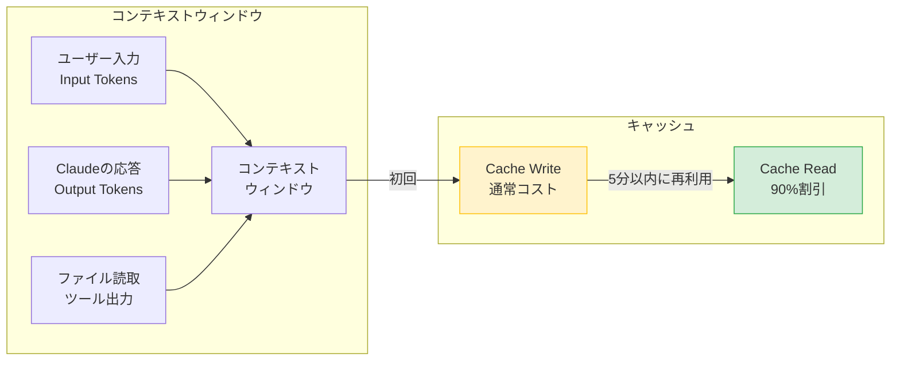
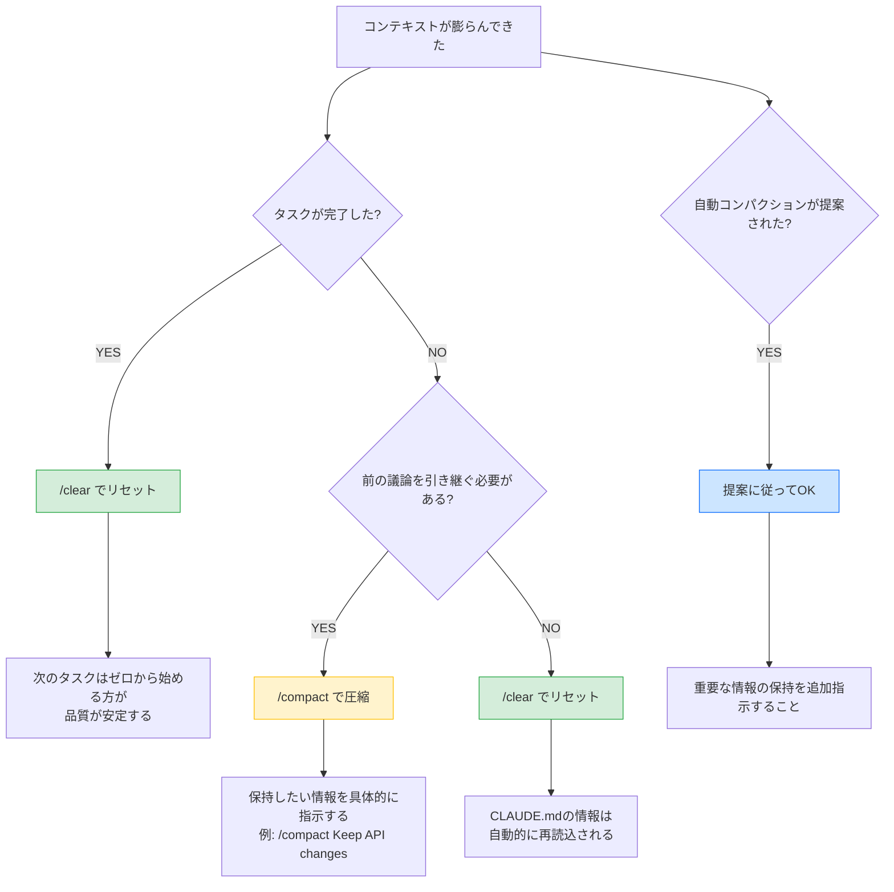

# Claude Code コンテキストウィンドウ管理ガイド

## はじめに

### こんな困りごとありませんか？

- コンテキストウィンドウがいっぱいになって応答品質が落ちた
- /compactと/clearのどちらを使うべきかわからない
- 自動コンパクションで重要な情報が失われた

### このガイドで解決できます

コンテキストウィンドウの仕組みと管理手法を理解すれば、セッションを長持ちさせつつ情報ロスを最小限に抑えられます。

| Before | After |
|--------|-------|
| コンテキストが溢れて指示を忘れる | /compact + CLAUDE.mdで情報を圧縮・復元 |
| いつ/clearすべきかわからない | フローチャートで即座に判断 |
| キャッシュの仕組みが不明 | トークン構成を理解し、コスト最適化 |

### 前提条件

| 項目 | 要件 |
|------|------|
| Claude Code | インストール済み・認証済み |
| 推奨 | ステータスライン設定済み（コンテキスト使用率をリアルタイム表示） |

---

## 1. コンテキストウィンドウの仕組み

Claude Codeのコンテキストウィンドウは、Claudeが「覚えている情報の量」を表します。このウィンドウがいっぱいになると、以前の指示を忘れたり、パフォーマンスが低下したりします。

**コンテキストウィンドウの構成要素**:

| 要素 | 説明 | トークン消費 |
|------|------|-------------|
| **Input Tokens** | ユーザーの指示、Readしたファイル、ツール出力 | あり |
| **Output Tokens** | Claudeの応答、生成したコード | あり |
| **Cache Write** | Claudeがキャッシュに保存した情報 | あり（初回のみ） |
| **Cache Read** | キャッシュから読み込んだ情報 | **90%割引** |



**キャッシュのメリット**:
- CLAUDE.md、よく読むファイル、長いツール出力をキャッシュすることで、次回以降のトークン消費を大幅削減
- キャッシュは5分間有効（5分以内に再度アクセスすると、Cache Readとして処理される）

**セッション累計の追跡**:
- `total_input_tokens`: セッション全体で送信したInput Tokens
- `total_output_tokens`: セッション全体でClaudeが生成したOutput Tokens
- コンテキストウィンドウの使用率（%）が80%を超えると警告

---

## 2. 使用状況の確認方法

**ステータスラインでリアルタイム確認**

Claude Codeのステータスラインは、4行のダッシュボード形式でコンテキストウィンドウ情報を表示します。

```
Line 1: [dir] [branch] | [model] | [context bar] [used%] [label] | [cost] | [duration] | [lines +/-]
Line 2: 📊 🪟 [current/total] (W:[cache_write] R:[cache_read]) | In:[total_input] Out:[total_output] | 残[remaining%]
Line 3: ⚡ [5h%] [reset] | 📅 [week%] [reset] | 🎵 [Sonnet%] [reset] | 🎹 [Opus%] [reset] | 🔥 [limit_impact]
Line 4: 🧠 CC:[memory] | App:[memory] | VSCode:[memory]
```

**Line 2の読み方**:
- `🪟 45.2k/200k` — 現在のコンテキストウィンドウ使用量/最大容量
- `W:12.3k` — キャッシュに書き込んだトークン数（初回コスト）
- `R:38.5k` — キャッシュから読み込んだトークン数（90%割引）
- `In:102k` — セッション累計Input Tokens
- `Out:25k` — セッション累計Output Tokens
- `残35%` — コンテキストウィンドウの残量

**色による警告**:

```
  コンテキスト使用率とアクションの目安

  0%                    59%  60%              79%  80%             100%
  ├──────────────────────┤────────────────────┤─────────────────────┤
  │ ████████████████████ │ ▓▓▓▓▓▓▓▓▓▓▓▓▓▓▓▓ │ ░░░░░░░░░░░░░░░░░░ │
  │     緑: OK           │   黄: WATCH        │   赤: SWITCH        │
  │                      │                    │                     │
  │  そのまま作業続行    │ あと1〜2タスクで   │ /compact で圧縮     │
  │                      │ 切り上げを意識     │ または /clear        │
  └──────────────────────┴────────────────────┴─────────────────────┘
```

- 緑: 0-59% — OK
- 黄: 60-79% — WATCH（注意）
- 赤: 80-100% — SWITCH（新しいセッションを推奨）

---

## 3. /compact の活用

**コンパクションとは**:
コンパクションは、現在のセッションの情報を**要約・圧縮**して新しいセッションに引き継ぐ機能です。コンテキストウィンドウが満杯に近づいた際に使用します。

**使い方**:
```
/compact 以下の情報を保持してください:
- プロジェクトの構造
- 現在実装中の機能
- 未解決のバグリスト
```

**自動コンパクション**:
コンテキストウィンドウが制限に近づくと、Claudeが自動的にコンパクションを提案します。

**情報ロスへの対策**:

| 対策 | 説明 |
|------|------|
| **保持すべき情報を明示** | コンパクション時に「保持すべき情報」を具体的に指示する |
| **CLAUDE.mdで定義** | SessionStartフックでcompact後に再注入するスクリプトを設定 |
| **マイルストーン・タスク管理を外部化** | scrum/tasks.md、scrum/milestones.md で進捗を管理 |

**CLAUDE.mdでのcompact保持ルール例**:
```markdown
# コンパクション時の保持ルール

/compact 実行時、以下を必ず保持:
- プロジェクト名・概要
- 現在のスプリントID・タスクID
- 未完了タスクのリスト
- 技術スタック・依存関係
```

---

## 4. /clear vs /compact の使い分けフローチャート

コンテキストが膨らんできたとき、`/clear`と`/compact`のどちらを使うべきか迷うことがあります。以下のフローチャートで判断してください。



**テキスト版（Mermaid非対応環境向け）**:

```
タスクが完了した？
├── YES → /clear（コンテキストを完全リセット）
│         次のタスクはゼロから始める方が品質が安定する
│
└── NO → タスクの途中でコンテキストが膨らんでいる
          │
          ├── 前の議論の内容を引き継ぐ必要がある？
          │   ├── YES → /compact（要約して圧縮）
          │   │         保持したい情報を具体的に指示する
          │   │         例: /compact Keep API changes and test results
          │   │
          │   └── NO → /clear（リセットしてやり直し）
          │             CLAUDE.mdに書いてある情報は自動的に再読込される
          │
          └── 自動コンパクションが提案された？
              └── YES → 提案に従ってOK
                        ただし重要な情報の保持を追加指示すること
```

**判断の目安**:
- ステータスラインが**黄色（60%超）**→ まだ余裕あり。タスク完了まで続行してから`/clear`
- ステータスラインが**赤（80%超）**→ 即座に`/compact`で圧縮するか、`/clear`でリセット
- **タスク完了後は常に`/clear`** — これが最もシンプルで効果的な運用ルール

---

## 5. ベストプラクティス

コンテキストウィンドウを長持ちさせるコツは意外とシンプルです。長いファイルは全体を読ませず`Read(file_path, offset, limit)`で必要な部分だけ読む。1セッションに大きなタスクを詰め込みすぎない。コンテキストが60%を超えたら`/compact`を検討する。CLAUDE.mdやよく参照するファイルをセッション開始直後に読ませてキャッシュに載せる。同じファイルを何度もReadしない（一度読めばキャッシュされている）。

特に「部分読み」は効果が大きいです。1000行のファイルを丸ごと読ませるのと、50行だけ読ませるのでは消費トークンが20倍違います。

---

## 6. TIPS

- **コンテキストウィンドウが60%を超えたら /compact を検討**
- **compact時に保持すべき情報を明示**する（プロジェクト構造、未完了タスク）
- **マイルストーン・タスク管理は外部ファイルで管理**する（scrum/tasks.md）
- **不要なReadを減らす** — 同じファイルを何度も読まない
- **ファイル全体ではなく、必要な部分だけ読む**（`Read(file_path, offset, limit)`）
- **ツール選択の工夫** — `Bash(cat file.txt)` ではなく `Read(file_path)` を使う

---

## 7. トラブルシューティング

### コンテキストが突然リセットされた

作業中にClaude Codeが以前の指示を忘れたように振る舞う場合、自動コンパクションが発生した可能性があります。コンテキストウィンドウが上限に近づくと自動的に圧縮が行われ、一部の情報が要約されます。重要な情報を保持するには、compact-reinject.shフックを設定するか、CLAUDE.mdに「コンパクション時の保持ルール」を記述しておいてください。タスク管理情報は外部ファイル（scrum/tasks.mdなど）に書き出しておくと、コンパクション後も参照できます。

---

## まとめ

コンテキスト管理のポイントは3つです。ステータスラインの色を見て残量を把握する。タスク完了後は`/clear`、途中なら`/compact`。重要な情報はCLAUDE.mdと外部ファイルに逃がしておく。この習慣を身につければ、セッション途中で情報が失われて困ることはほぼなくなります。

### 参考リンク

- [Claude Code公式 - コンテキスト管理](https://docs.anthropic.com/en/docs/claude-code/best-practices#manage-context)
- [Claude Code公式 - メモリとコンテキスト](https://docs.anthropic.com/en/docs/claude-code/memory)
