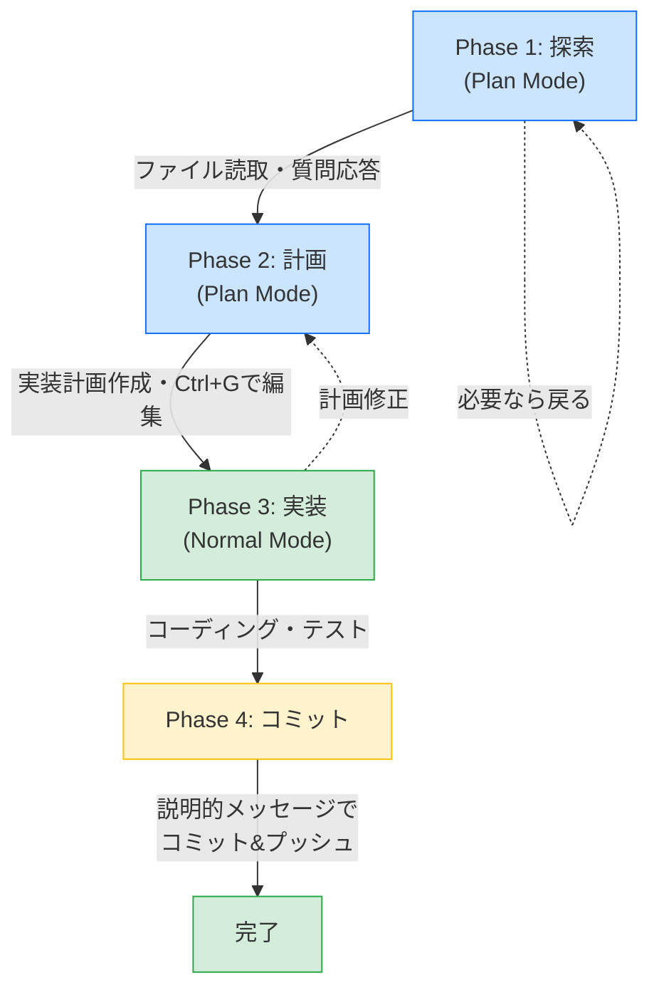

# VSCodeでClaude Codeを使う完全ガイド

### こんな困りごとありませんか？

- ターミナルとエディタを何度も切り替えるのが面倒
- Claude Codeの出力がどこに反映されたか追いにくい
- コンテキスト使用率や利用制限がいまどれくらいか把握できない

### このガイドで解決できます

VSCode拡張を使えば、エディタ内でAIとの対話・コード変更のdiff確認・ステータス監視がすべて完結します。ターミナルを開く必要はありません。

| Before | After |
|--------|-------|
| ターミナルでClaude Code実行 → エディタで変更確認 → 行ったり来たり | VSCode内のサイドパネルで対話、インラインdiffでその場確認 |
| コンテキスト使用率は `--verbose` で手動確認 | ステータスラインで常時リアルタイム表示 |

### 前提条件

| 項目 | 要件 |
|------|------|
| OS | macOS 13.0+ / Windows 10 1809+ / Ubuntu 20.04+ |
| VSCode | 最新版推奨 |
| Claude Code | インストール済み（`claude --version` で確認） |
| アカウント | Claude Pro / Max / Teams / Enterprise（無料プラン非対応） |

---

## 1. はじめに — VSCode + Claude Codeの利点

### なぜVSCodeで使うのか

最初はターミナルでClaude Codeを使っていて「これで十分だ」と思っていました。ところがVSCode拡張を入れた瞬間、ターミナルとエディタの往復がいかに集中力を削いでいたかに気づきます。

一番大きいのは**インラインdiff**です。Claudeが提案した変更がエディタ上にそのまま表示されるので、「何が変わるのか」を読んでからAccept/Rejectを選べます。部分的に採用したければEditボタンで手を入れてからAcceptすることもできます。AIの提案を100%受け入れなくていいという安心感は、使ってみると想像以上に大きいです。

`@`メンションでファイルを直接参照できること、Plan Modeで実装前に計画全体を確認できること、`Ctrl+Esc`でチャットをワンキー起動できることも、地味ですが毎日の作業でじわじわ効いてきます。

### CLIとの使い分け

VSCode拡張とCLIは、どちらか片方に絞る必要はありません。インラインdiffでコード変更を目で確認したい場面ではVSCode拡張、複数ファイルの一括変更やAgent TeamsのようなCLI限定機能を使いたい場面ではターミナルと、場面に応じて切り替えるのが一番ストレスが少ないやり方です。自分の場合、日中のコーディングはVSCode、夜間に走らせる長時間タスクはtmux + CLIという使い分けに落ち着きました。

---

## 2. セットアップ

### 2.1. Claude Code拡張機能のインストール

**ステップ1: 拡張機能のインストール**

1. VSCodeを開く
2. サイドバーの拡張機能アイコンをクリック（または`Cmd+Shift+X`）
3. 検索バーに `Claude Code` と入力
4. "Claude Code" を見つけてインストール

**ステップ2: 認証**

初回起動時に認証が必要です:

```bash
# CLIで認証済みの場合は不要
claude login
```

認証が完了すると、VSCodeでもClaude Codeが利用可能になります。

### 2.2. セカンダリサイドバーへの配置

Claude Codeをセカンダリサイドバーに配置することで、プライマリサイドバーのファイルツリーと併用できます。

**手順**:

1. Claude Codeのアイコンを**右クリック**
2. "Move to Secondary Side Bar" を選択
3. サイドバーの反対側（右側）にClaude Codeが表示される

**ショートカットで表示切り替え**:

```
Cmd+Opt+B  — セカンダリサイドバーの表示/非表示
```

これにより、以下のようなレイアウトが可能になります:

```
┌──────────────┬─────────────────┬──────────────┐
│ ファイルツリー │  エディタペイン    │ Claude Code  │
│ (Primary)    │                 │ (Secondary)  │
│              │                 │              │
│ src/         │  index.ts       │ チャット     │
│ docs/        │  (...編集中...) │ (会話履歴)   │
│ package.json │                 │ プラン表示   │
└──────────────┴─────────────────┴──────────────┘
```

---

## 3. 基本的な使い方

### 3.1. チャットの起動

**方法1: ショートカット**

```
Ctrl+Esc  — チャットウィンドウを開いてフォーカス
```

**方法2: コマンドパレット**

```
Cmd+Shift+P → "Claude Code: Open Chat"
```

**方法3: サイドバーから**

セカンダリサイドバーのClaude Codeアイコンをクリック

### 3.2. インラインdiff

コード変更がある場合、VSCode上でインラインdiffが表示されます。**Accept**で変更を適用、**Reject**で元に戻す、**Edit**で内容を手動修正してから適用、という3択で操作できます。

```
┌─ src/api/routes.ts ──────────────────────────────────────────┐
│                                                              │
│  10 │ app.get('/users', async (req, res) => {                │
│  11 │-  const users = await db.query('SELECT * FROM users'); │ ← 削除行（赤）
│  11 │+  const users = await db.query(                        │ ← 追加行（緑）
│  12 │+    'SELECT id, name, email FROM users WHERE active=1' │
│  13 │+  );                                                   │
│  14 │   res.json(users);                                     │
│  15 │ });                                                    │
│                                                              │
│  ┌─────────┐ ┌─────────┐ ┌─────────┐                        │
│  │ Accept  │ │ Reject  │ │  Edit   │  ← 3つのアクションボタン│
│  └─────────┘ └─────────┘ └─────────┘                        │
└──────────────────────────────────────────────────────────────┘
```

> 参考: [VSCode拡張の使い方 — 公式ドキュメント](https://docs.anthropic.com/en/docs/claude-code/ide-integrations#accept-or-reject-changes)

「ここだけ変えたい、他は不要」という場面では、EditでAIの提案を一部削除してからAcceptするのが便利です。AIの提案を100%そのまま採用しなくていい、というのが意外と大きな安心感につながります。

### 3.3. @メンションでファイル参照

チャット内で`@`を入力すると、参照したいリソースをメンションできます。入力中にオートコンプリートが表示され、ファイルやシンボルを選択できます。

```
┌─ Claude Code チャット ──────────────────────────────┐
│                                                      │
│ あなた: @ind                                         │
│         ┌────────────────────────────┐               │
│         │ 📄 index.ts               │ ← ファイル    │
│         │ 📄 index.test.ts          │               │
│         │ 📁 internal/              │ ← フォルダ    │
│         │ 🔤 initializeApp()        │ ← シンボル    │
│         └────────────────────────────┘               │
│                                                      │
└──────────────────────────────────────────────────────┘
```

**使用例**:

```
@index.ts のエラーハンドリングを改善して
@src/utils/validation.ts と整合性を取って
@workspace 内のすべてのTODOコメントをリストアップ
```

**参照できるもの**:

- `@<ファイル名>` — 特定のファイル
- `@<フォルダ名>` — フォルダ内のファイル
- `@workspace` — ワークスペース全体
- `@<関数名>`, `@<クラス名>` — シンボル参照

### 3.4. Plan Modeの確認

Claude Codeは実行前に計画（Plan）を提示します。

**Plan Modeの流れ**:

1. あなたがタスクを依頼
2. Claude Codeが実行計画を提示
3. **Ctrl+G**を押して計画を編集可能
4. **Approve**で実行開始

**例**:

```
あなた: APIエンドポイントにバリデーションを追加して

Claude Code:
Plan:
1. src/api/routes.ts にバリデーションミドルウェアを追加
2. src/validators/userValidator.ts を新規作成
3. テストケースを tests/api/routes.test.ts に追加

[Approve] [Edit (Ctrl+G)] [Cancel]
```

**Ctrl+G**を押すと計画をテキストとして編集でき、実行範囲を調整できます。

---

## 4. ステータスラインの設定

ステータスラインを設定すると、VSCode下部のステータスバーにClaude Codeの状態をリアルタイム表示できます。

### 4.1. settings.jsonでの設定方法

`~/.claude/settings.json` に以下を追加:

```json
{
  "statusLine": {
    "type": "command",
    "command": "bash ~/.claude/statusline-command.sh"
  }
}
```

この設定により、VSCodeのステータスバーにカスタムスクリプトの出力が表示されます。

### 4.2. カスタムスクリプトの仕組み

`statusline-command.sh` は、以下の情報を収集して整形します:

**情報源**:

- **プロジェクト情報**: プロジェクト名、Gitブランチ、未コミット変更
- **セッション情報**: 使用モデル、コンテキスト使用率、コスト、所要時間
- **コンテキストウィンドウ**: 現在トークン数、キャッシュ状況、入出力累計
- **利用制限**: 5時間制限、7日間制限、モデル別制限（Sonnet/Opus）
- **メモリ使用量**: Claude Code CLI、デスクトップアプリ、VSCodeの消費メモリ

**動作**:

```bash
# スクリプトは環境変数 CLAUDE_CODE_CONTEXT から情報を取得
# JSON形式のコンテキストデータをパースして整形
# 4行のテキストを出力
```

**更新頻度**: セッション内で変更があるたびに自動更新されます。

---

## 5. 4行ダッシュボードの読み方

ステータスラインスクリプトは4行のダッシュボードを表示します。

### Line 1: セッション情報

```
[プロジェクト名] [Git:ブランチ*] | [モデル名] | [コンテキストバー XX% OK/WATCH/SWITCH] | [$コスト] | [Xm Xs] | [+追加/-削除]
```

**例**:

```
claude-code-guide [Git:main*] | Sonnet 4.5 | [████████████░░░░░░░░ 62% WATCH] | $0.12 | 3m 42s | +152/-48
```

| 項目 | 説明 |
|-----|------|
| `claude-code-guide` | プロジェクト名 |
| `Git:main*` | Gitブランチ（`*`は未コミット変更あり） |
| `Sonnet 4.5` | 使用中のモデル |
| `62% WATCH` | コンテキスト使用率62%（注意レベル） |
| `$0.12` | セッション累計コスト |
| `3m 42s` | セッション所要時間 |
| `+152/-48` | 追加/削除行数 |

### Line 2: コンテキストウィンドウ

```
📊 🪟 [現在トークン]/[最大] (W:[キャッシュ書込] R:[キャッシュ読取]) | In:[累計入力] Out:[累計出力] | 残XX%
```

**例**:

```
📊 🪟 124K/200K (W:45K R:89K) | In:256K Out:142K | 残38%
```

| 項目 | 説明 |
|-----|------|
| `124K/200K` | 現在のコンテキストトークン数 / 最大トークン数 |
| `W:45K` | キャッシュ書き込みトークン数（新規コンテキスト） |
| `R:89K` | キャッシュ読み取りトークン数（再利用） |
| `In:256K` | セッション累計入力トークン |
| `Out:142K` | セッション累計出力トークン |
| `残38%` | 残りコンテキスト容量 |

**TIPS**: キャッシュ読み取り（R）が多いほど効率的で、コストが抑えられます。

### Line 3: 利用制限

```
⚡ [5h制限%] [リセット時間] | 📅 [週間制限%] [リセット] | 🎵 [Sonnet%] | 🎹 [Opus%] | 🔥 [制限影響量]
```

**例**:

```
⚡ 42% 3h12m後 | 📅 18% 5d 14h後 | 🎵 38% | 🎹 15% | 🔥 Moderate
```

| 項目 | 説明 |
|-----|------|
| `⚡ 42% 3h12m後` | 5時間ローリングウィンドウ使用率42%、リセットまで3時間12分 |
| `📅 18% 5d 14h後` | 7日間制限使用率18%、リセットまで5日14時間 |
| `🎵 38%` | Sonnet使用率38% |
| `🎹 15%` | Opus使用率15% |
| `🔥 Moderate` | 制限影響度（Low/Moderate/High/Critical） |

### Line 4: メモリ使用量

```
🧠 CC:[CLI消費メモリ] | App:[デスクトップアプリ] | VSCode:[VSCode]
```

**例**:

```
🧠 CC:142MB | App:0MB | VSCode:589MB
```

| 項目 | 説明 |
|-----|------|
| `CC:142MB` | Claude Code CLI（ターミナル）のメモリ使用量 |
| `App:0MB` | デスクトップアプリ（未起動の場合0MB） |
| `VSCode:589MB` | VSCode拡張のメモリ使用量 |

**メモリ管理のTIPS**:

- 長時間セッションでメモリが増えすぎた場合は`/clear`または再起動
- Agent Teamsを使用するとメモリ消費が増加するため注意

---

## 6. 色の意味と閾値

ステータスラインの色は「今すぐ何かすべきか」を直感的に伝えてくれます。信号機と同じで、緑なら安心、黄色は注意、赤は対処が必要です。

### コンテキスト使用率

コンテキスト使用率が60%未満なら緑で「OK」と表示されます。そのまま作業を続けて問題ありません。60〜80%になると黄色の「WATCH」に変わります。この段階では作業は継続できますが、あと数回の大きなファイル読み込みで赤に達する可能性があります。80%を超えると赤の「SWITCH」表示になり、`/compact`でコンテキストを圧縮するか、`/clear`でリセットするタイミングです。

体感として、黄色が見えたら「あと1〜2タスクで切り上げよう」と意識すると、赤に達してから慌てずに済みます。

### 利用制限

利用制限の色分けはコンテキストとは閾値が異なります。70%未満が緑（Safe）、70〜85%が黄色（Caution）、85%以上が赤（Danger）です。赤になったらモデルをHaikuに切り替えるか、セッションを分割して消費を抑えましょう。

### 制限影響度

`🔥` アイコンの横に表示されるLow / Moderate / High / Criticalは、現在のセッションが制限にどの程度影響しているかを示します。Lowなら気にせず作業継続、Moderateになったら軽量なタスクはHaikuに回すことを検討します。HighやCriticalが表示されたら、大きなリファクタリングは避けてリセットを待つのが賢明です。

---

## 7. TIPS

### 7.1. ショートカット一覧

| ショートカット | 機能 |
|--------------|------|
| `Ctrl+Esc` | チャットウィンドウを開く |
| `Cmd+Opt+B` | セカンダリサイドバーの表示/非表示 |
| `Ctrl+G` | Plan Modeで計画を編集 |
| `Cmd+Shift+P` | コマンドパレット（Claude Code関連コマンド検索） |

### 7.2. スラッシュコマンド（チャット内）

チャット内で`/`を入力すると、便利なコマンドが使えます:

| コマンド | 機能 |
|---------|------|
| `/clear` | セッションをクリア（コンテキストリセット） |
| `/compact <指示>` | コンテキストを圧縮（選択的に保持） |
| `/context` | コンテキスト使用状況の詳細表示 |
| `/model <モデル名>` | 使用モデルの切り替え |
| `/help` | ヘルプ表示 |

### 7.3. コンテキスト管理のベストプラクティス

> `/clear`と`/compact`の使い分けに迷ったら、[コンテキスト管理ガイドのフローチャート](./context-management.md#4-clear-vs-compact-の使い分けフローチャート)を参照してください。

**頻繁に`/clear`を実行**

- タスクが完了したら`/clear`でコンテキストをリセット
- 次のタスクに移る前にクリアすることで、前のタスクの文脈が混ざるのを防ぐ

**大きなファイルは部分読み込み**

```
@src/large-file.ts の500〜600行目だけレビューして
```

**`/compact`で選択的に圧縮**

```
/compact Focus on the API changes, discard UI discussions
```

これにより、API変更に関する情報を保持しながら、UI関連の議論を削除できます。

### 7.4. 利用制限を意識した使い方

**モデルの使い分け**

| モデル | 推奨用途 | 制限への影響 |
|-------|---------|-----------|
| **Opus 4.6** | 複雑なリファクタリング、アーキテクチャ設計 | 大 |
| **Sonnet 4.5** | 日常的なコーディング、レビュー | 中 |
| **Haiku 4.5** | 簡単な修正、フォーマット、ドキュメント作成 | 小 |

**制限が近い時の対策**:

1. `/model haiku` で軽量モデルに切り替え
2. タスクを分割して複数セッションに分ける
3. キャッシュヒット率を上げる（同じファイルを繰り返し参照）

### 7.5. Plan Modeの活用

**推奨4フェーズワークフロー**:



**テキスト版（Mermaid非対応環境向け）**:

```
Phase 1: 探索（Plan Mode）
    │ ファイル読み取り・質問応答
    ▼
Phase 2: 計画（Plan Mode）
    │ 実装計画作成、Ctrl+Gで編集
    ▼
Phase 3: 実装（Normal Mode）
    │ コーディング・テスト
    ▼
Phase 4: コミット
    │ 説明的メッセージでコミット&プッシュ
```

このフローに従うことで、無駄な実行を減らし、制限を効率的に使えます。

### 7.6. セカンダリサイドバーの活用

**理想的なレイアウト**:

```
左サイドバー（Primary）:
  - ファイルツリー
  - 検索
  - Git管理

右サイドバー（Secondary）:
  - Claude Code チャット
  - プラン確認
  - インラインdiff承認

中央:
  - エディタペイン（複数ファイル並行編集）
```

**複数ペインで並行作業**:

1. 左側でファイルツリーを見ながら
2. 中央で複数のファイルを開いて
3. 右側でClaude Codeと対話

これにより、情報を行き来せず効率的に作業できます。

---

## 8. トラブルシューティング

### 拡張機能が起動しない・チャットが開かない

まず`claude --version`でCLIが動作するか確認してください。CLIが動くのに拡張機能が反応しない場合は、VSCodeのOutput Panel（`Cmd+Shift+U`）で「Claude Code」チャンネルを選択し、エラーメッセージを確認します。よくある原因は認証の期限切れで、ターミナルで`claude login`を再実行すると解消します。それでもダメなら拡張機能をアンインストール→再インストールしてみてください。

### ステータスラインが表示されない

settings.jsonに`statusLine`設定を追加したのに表示されない場合、まずスクリプトのパスが正しいか確認します。`bash ~/.claude/statusline-command.sh`をターミナルで直接実行して出力が出るかテストしてください。出力はあるのにVSCode上に表示されない場合、VSCodeを再起動すると反映されることがあります。なお、ステータスラインはClaude Codeのセッションがアクティブな間のみ更新されます。

### インラインdiffが表示されない

Claude Codeがファイルを編集したのにdiffが出ない場合、対象ファイルがエディタで開かれていないことが原因であるケースが多いです。Claude Codeが編集するファイルを事前に開いておくか、変更後にファイルを開き直すとdiffが確認できます。また、VSCodeの設定で`diffEditor`が無効になっていないか確認してください。

### @メンションでファイルが見つからない

`@`でファイル名を入力しても候補が出ない場合、ワークスペースのインデックスが完了していない可能性があります。VSCodeを開いた直後は大きなプロジェクトのインデックスに時間がかかるため、少し待ってから再試行してください。`.gitignore`で除外されているファイルは候補に表示されない点も注意が必要です。

### セカンダリサイドバーが表示されない

「Move to Secondary Side Bar」のメニューが見つからない場合、Claude Codeのアイコンを**右クリック**しているか確認してください（左クリックでは表示されません）。また、VSCodeのバージョンが古いとセカンダリサイドバー自体が存在しない場合があります。`Help > About`でバージョンを確認し、最新版にアップデートしてください。

---

## 9. まとめ

VSCode + Claude Codeを使い始めて最初に感じるのは「ターミナルを開かなくていい」という解放感です。セカンダリサイドバーにAIチャットを置けば、ファイルツリーと会話履歴を同時に見ながら作業できます。インラインdiffで変更内容をその場で確認・承認でき、@メンションでファイル参照が直感的になります。ステータスラインはコンテキスト残量をリアルタイムで教えてくれるため、「なんか重くなってきた」というタイミングを見逃しません。

### 次のステップ

1. **Hooksを設定する** — 自動Lint、Slack連携、Push前チェック
2. **MCPサーバーを追加する** — Slack、GitHub、Notionと連携
3. **カスタムスキルを作成する** — 頻繁に使うタスクをスキル化
4. **Agent Teamsを試す** — 複数エージェントで複雑なタスクを分担

### 参考リンク

- [Claude Code 公式ドキュメント](https://code.claude.com/docs/ja/overview)
- [VSCode拡張 使い方](https://code.claude.com/docs/ja/vscode)
- [ステータスライン設定](https://code.claude.com/docs/ja/settings#statusline)
- [Plan Mode活用法](https://code.claude.com/docs/ja/best-practices#plan-mode)

---

VSCode + Claude Codeの組み合わせは、セットアップさえ済めばすぐに効果を実感できます。最初の1時間はセカンダリサイドバーの配置とステータスラインの設定に使い、あとはいつもの開発タスクをClaude Codeに話しかけながら進めてみてください。インラインdiffで変更をその場で確認する体験は、一度味わうとターミナルとエディタを行き来する気がなくなります。
